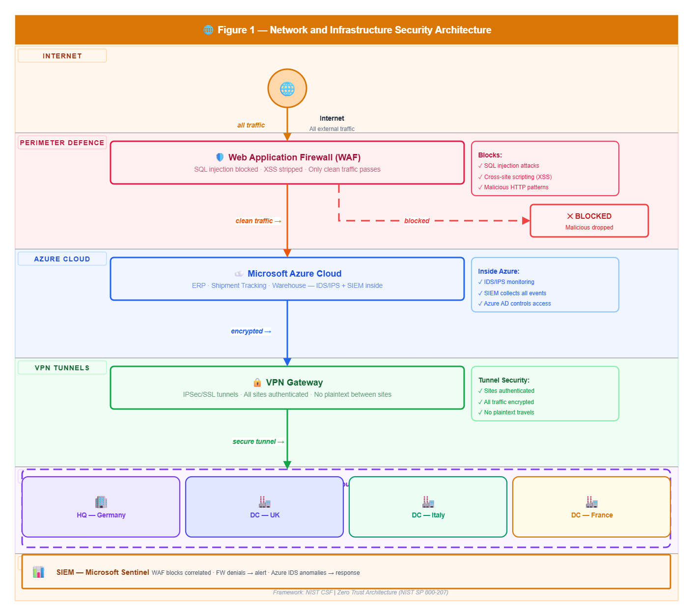
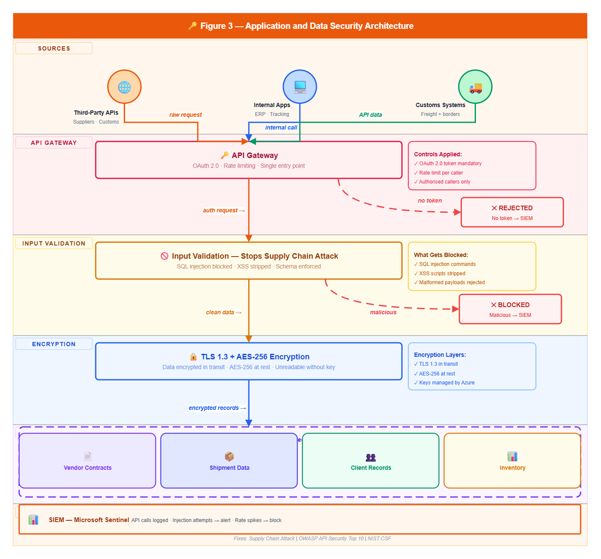
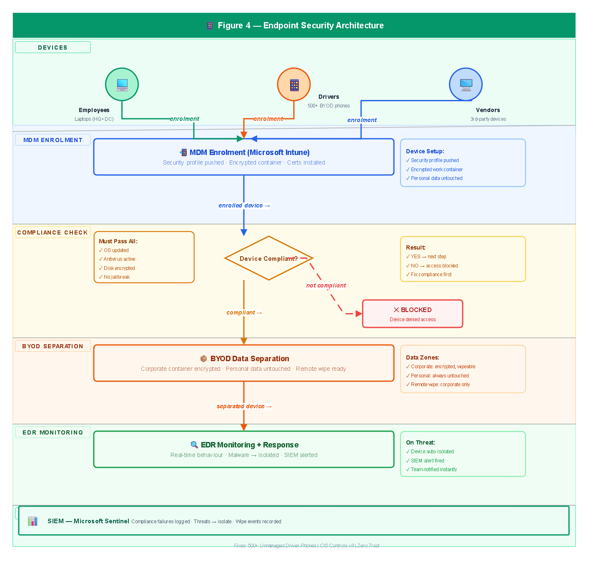
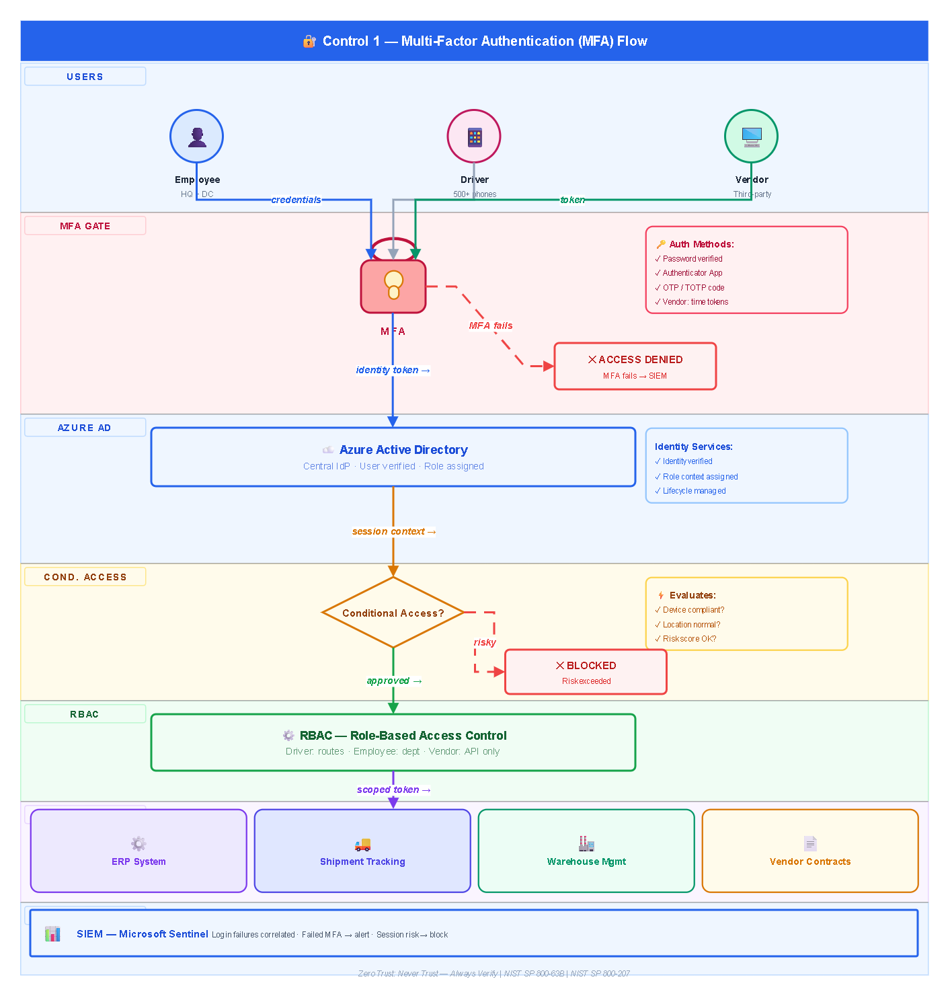
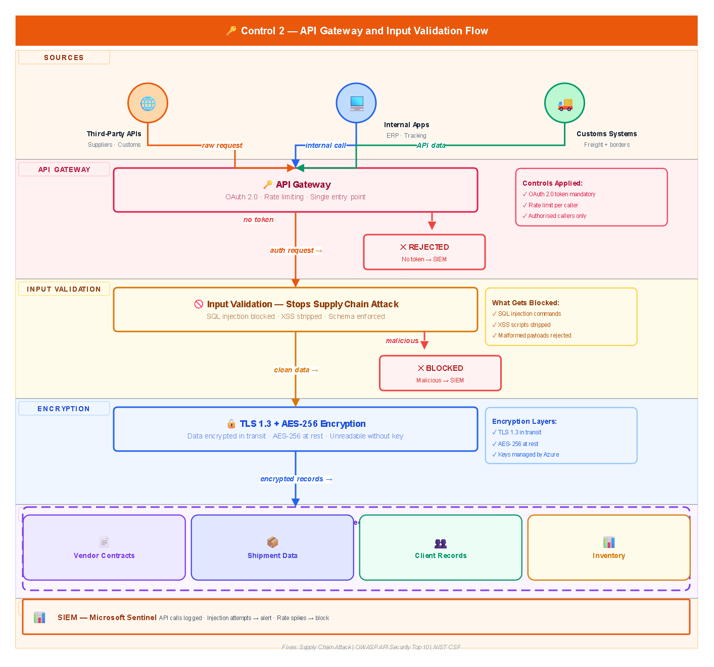
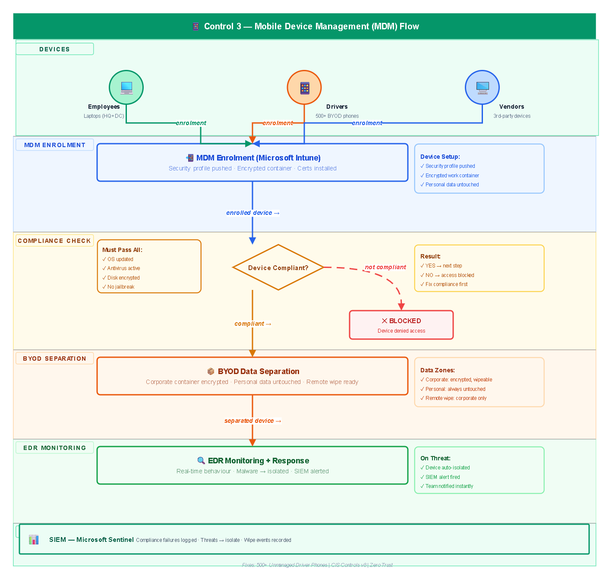
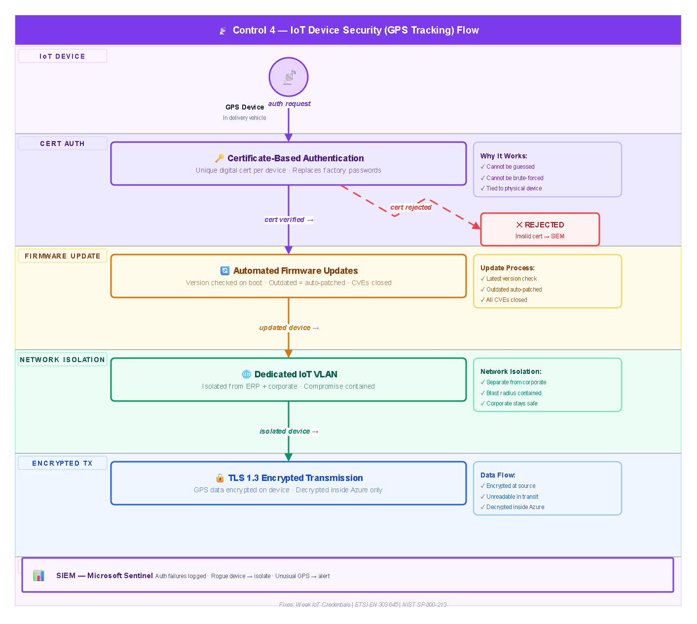
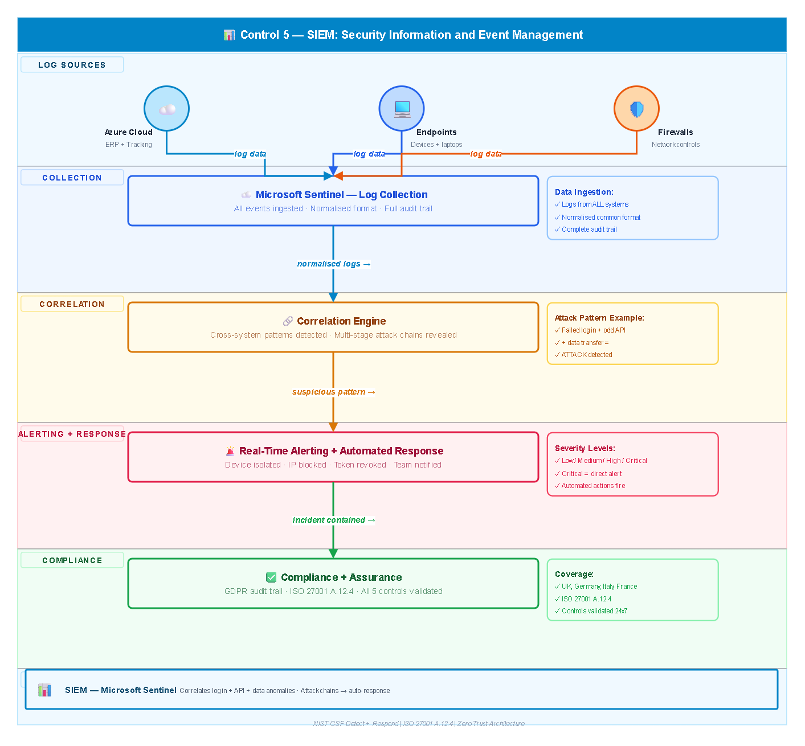

# COM7018 — Secure System Design Portfolio
### Arden University — MSc Cybersecurity

## Overview
This portfolio presents a complete Zero Trust security 
architecture designed for a logistics company operating 
across the UK, Germany, Italy and France.

Three real security problems were identified and solved:

- Supply chain API attack from a compromised vendor
- 500+ delivery drivers using unmanaged personal phones
- IoT GPS devices running on weak factory credentials

## Security Controls Designed

| Control | Tool Used | Problem Solved |
|---|---|---|
| Multi-Factor Authentication | Azure AD + Conditional Access | Credential theft |
| API Gateway + Input Validation | Azure API Gateway + OAuth 2.0 | Supply chain attack |
| Mobile Device Management | Microsoft Intune | Unmanaged BYOD phones |
| IoT Device Security | Certificate Auth + VLAN | Weak IoT credentials |
| SIEM Monitoring | Microsoft Sentinel | No visibility or detection |

## Architecture Diagrams

### Figure 1 — Network and Infrastructure Security

### Figure 2 — User Access and Authentication

### Figure 3 — Application and Data Security

### Figure 4 — Endpoint Security

### Control 1 — MFA Flow

### Control 2 — API Gateway Flow

### Control 3 — MDM Flow

### Control 4 — IoT Security Flow

### Control 5 — SIEM Flow

## Full Portfolio Report
[Download PDF Report](COM7018_System%20Security.pdf)

## Frameworks Used
- NIST SP 800-207 — Zero Trust Architecture
- NIST Cybersecurity Framework
- ISO/IEC 27001:2022
- OWASP API Security Top 10
- ETSI EN 303 645 — IoT Security
- CIS Controls v8

## Tools Used
- Microsoft Azure (AD, API Gateway, Intune, Sentinel)
- Draw.io — all 9 security architecture diagrams
- Microsoft Word — full portfolio report
